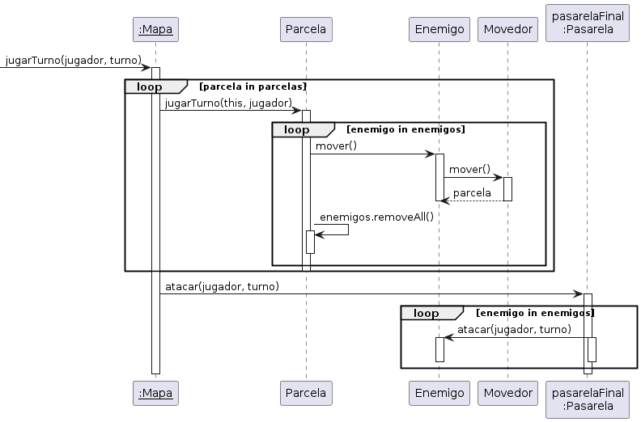

# TP2 - AlgoDefense
## Algoritmos y Programación 3
## Grupo11
* **108397 - Alejo Ordoñez** - [alejoordonez02](https://github.com/alejoordonez02)
* **109007 - Fernando Yu** - [fernandoyu](https://github.com/FernandoYu)
* **105414 - Gonzalo Olmos** - [gonzalo912](https://github.com/gonzalo912)

## Supuestos
- Cuando muere una lechuza retorna 5 créditos

## Diagramas de clases
### Juego Jugador y Mapa

### Defensas

### Defensas y Parcelas

### Herencia Enemigos

### Movedor con Strategy

## Diagramas de secuencia
### Inicialización

### Torre usando Rango para atacar

### Trampa Arenosa ralentizando enemigos

### Enemigos moviéndose y atacando

## Diagrama de paquetes
### Paquetes

### Modelo-vista-controlador

## Diagramas de estado
### Torre pasa a estar operativa

### Enemigo pasa a estar ralentizado

## Detalles de implementación
Para el desarrollo de la aplicación fuimos cuidadosos con los pilares de la programación orientada a objetos. Aplicamos algunos de sus principios, como "Tell Don't Ask", Ley de Demeter, Programación contra Interfaces, entre otros.
Hicimos uso del patrón de diseño "Strategy" para la implementación de la movilidad de los enemigos. Esto nos permitió no repetir código y lograr una solución mucho más robusta y de fácil extensión.
También usamos el patrón "Modelo-vista-controlador" para separar el código según su responsabilidad.

## Excepciones
- ParcelaInvalida: se lanza cuando se quiere construir una defensa en un terreno en el cuál no se puede edificar.
- CreditosInsuficientes: salta cuando los créditos del jugador no alcanzan para construir una defensa determinada.
- JSONVacio: se arroja cada vez que se quiere parsear un JSON que está vacío
- FormatoJSONINvalido: si el formato del JSON que se intenta parsear no es el correcto se arroja esta excepción